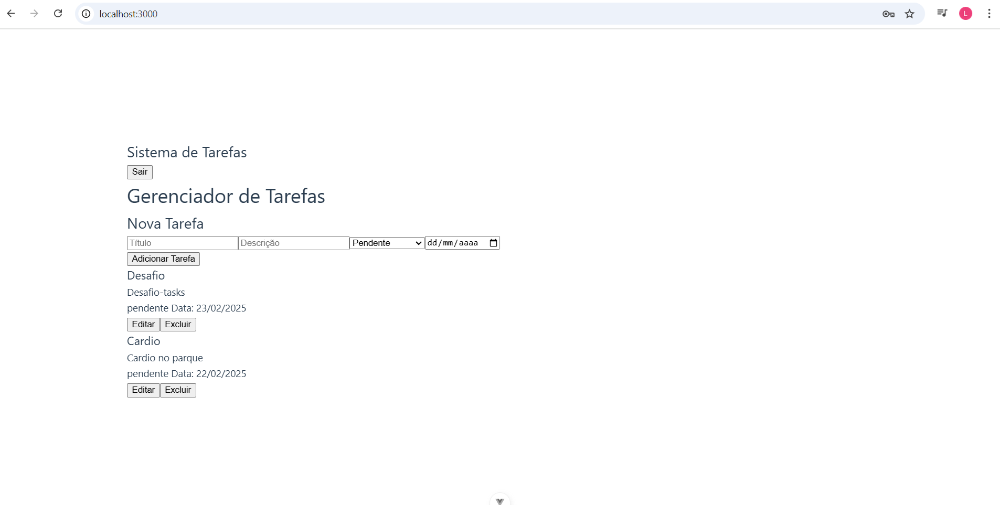
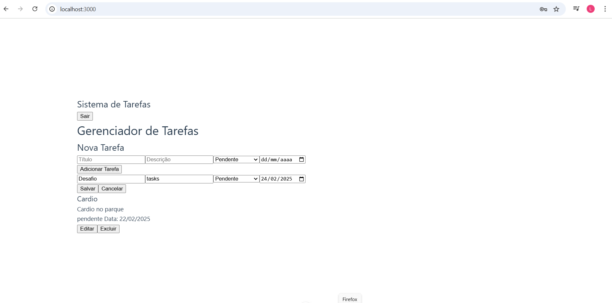
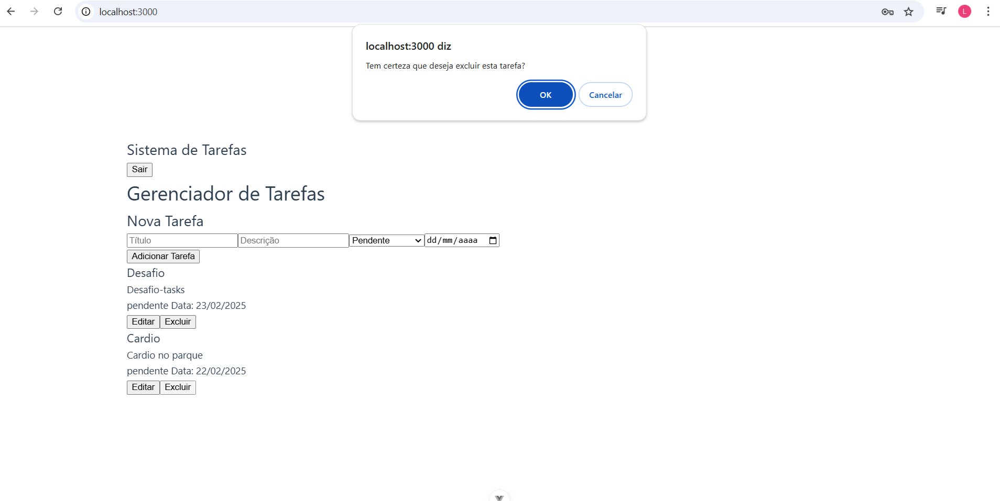

# 📋 Sistema de Gerenciamento de Tarefas

Um sistema para gerenciamento de tarefas, construído com Laravel 10 e Vue.js 3, utilizando as melhores práticas de desenvolvimento e arquitetura de software.

## 🚀 Funcionalidades

- ✨ Interface moderna e responsiva
- 🔐 Autenticação segura com JWT
- 📱 CRUD completo de tarefas
- 🎯 Gestão de status das tarefas
- 👥 Multi-usuário com isolamento de dados
- 🔄 Atualizações em tempo real
- 🎨 Design moderno com Tailwind CSS

## 🛠️ Tecnologias Utilizadas

### Backend
- Laravel 10
- PHP 8.2
- MySQL 8.0
- JWT Authentication
- RESTful API

### Frontend
- Vue.js 3
- JWT.
- Tailwind CSS
- Axios
- Vue Router

### DevOps
- Docker
- Docker Compose
- Nginx
- Git

## 📦 Pré-requisitos

- Docker
- Docker Compose
- Git

## 🚀 Instalação com Docker

### Pré-requisitos
- Docker (versão 20.10 ou superior)
- Docker Compose (versão 2.0 ou superior)
- Git

### Passo a passo

1. Clone o repositório:
```bash
git clone https://github.com/laraemi/desafio-tasks.git
cd desafio-tasks
```

2. Configure as variáveis de ambiente:
```bash
# Configure o backend
cp backend/.env.example backend/.env

# Configure o frontend
cp frontend/.env.example frontend/.env
```

3. Inicie os containers:
```bash
docker-compose up -d
```

4. Execute as configurações iniciais:
```bash
# Instalar dependências do backend
docker-compose exec app composer install

# Executar migrations
docker-compose exec app php artisan migrate

# Gerar chave da aplicação
docker-compose exec app php artisan key:generate

# Instalar dependências do frontend
docker-compose exec frontend npm install
```

5. Acesse a aplicação:
- Frontend: http://localhost:3000
- Backend: http://localhost:8000
- API: http://localhost:8000/api

## 📚 Estrutura da API

### Autenticação
- POST `/api/register` - Registro de novo usuário
- POST `/api/login` - Login de usuário
- POST `/api/logout` - Logout de usuário

### Tarefas
- GET `/api/tasks` - Lista todas as tarefas do usuário
- POST `/api/tasks` - Cria uma nova tarefa
- PUT `/api/tasks/{id}` - Atualiza uma tarefa existente
- DELETE `/api/tasks/{id}` - Remove uma tarefa

### Formato das Tarefas
```json
{
    "title": "Título da Tarefa",
    "description": "Descrição detalhada",
    "status": "pendente|em andamento|concluída",
    "due_date": "2024-02-25"
}
```

## 🔐 Autenticação

O sistema utiliza JWT (JSON Web Tokens) para autenticação. Para fazer requisições autenticadas, inclua o token no header:

```
Authorization: Bearer <insira otoken aqui>
```

## 🎨 Interface

### Telas Principais
- Login/Registro
- Dashboard de Tarefas
- Formulário de Criação/Edição
- Visualização Detalhada

### Recursos da Interface
- Drag and Drop para atualização de status
- Filtros e Ordenação
- Temas Light/Dark
- Responsividade
## 🖼️ Imagens do Projeto

### 1. Tela de Login


### 2. Lista de Tarefas


### 3. Edição de Tarefas


### 4. Deletar Tarefas


## 📁 Estrutura do Projeto
```
desafio-tasks/
├── backend/               # API Laravel
│   ├── app/
│   ├── config/
│   ├── database/
│   ├── routes/
│   └── tests/
├── frontend/              # Aplicação Vue.js
│   ├── src/
│   ├── public/
│   └── components/
├── docker/                # Configurações Docker
│   ├── nginx/
│   └── php/
├── docs/                  # Documentação e Imagens
│   └── imagens/           
└── docker-compose.yml
```

## 🔧 Configuração de Desenvolvimento

### Backend
```bash
# Instalar dependências
docker compose exec app composer install

# Rodar migrations
docker compose exec app php artisan migrate

# Gerar chave da aplicação
docker compose exec app php artisan key:generate
```

### Frontend
```bash
# Instalar dependências
docker compose exec frontend npm install

# Rodar em modo desenvolvimento
docker compose exec frontend npm run dev
```

## 🧪 Testes

### Backend
```bash
docker compose exec app php artisan test
```

### Frontend
```bash
docker compose exec frontend npm run test
```

## 📈 Performance

O sistema foi otimizado para:
- Carregamento rápido
- Cache eficiente
- Queries otimizadas
- Baixo consumo de recursos

## 🔒 Segurança

- Proteção contra CSRF
- Sanitização de inputs
- Rate limiting
- Validação de dados
- Proteção contra XSS

## 📝 Licença

Este projeto está sob a licença MIT. Veja o arquivo [LICENSE](LICENSE) para mais detalhes.


